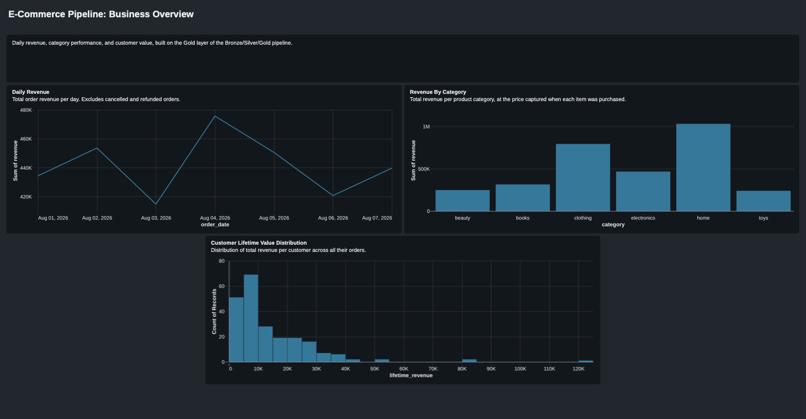

# E-Commerce Data Pipeline

A synthetic e-commerce dataset generator feeding a Bronze/Silver/Gold pipeline on
Databricks. Built to demonstrate incremental ingestion, deduplication, data
quality quarantine, and business-facing aggregation, end to end, against data
with realistic, deliberately injected corruption rather than a clean toy dataset.

## Architecture

```
data_generator/  (Faker, deterministic seeding, 5 injected data quality issues)
        |
        v  Parquet, date-partitioned, uploaded to a Unity Catalog Volume
+-------------------+
|  Bronze            |  Auto Loader, append-only, raw fidelity, no cleaning
|  bronze.<entity>   |  6 tables: customers, products, orders, order_items,
+-------------------+  payments, events
        |
        v  MERGE INTO, dedup, quarantine
+---------------------+
|  Silver              |  One clean row per real event, validated
|  silver.<entity>     |  + silver.orders_quarantine for unfixable rows
+---------------------+
        |
        v  full recompute each run
+----------------------------+
|  Gold                       |  Business-facing aggregates
|  daily_revenue               |
|  category_revenue            |
|  customer_lifetime_value     |
+----------------------------+
```

Catalog layout: `ecommerce_project.{bronze,silver,gold}`, plus the landing
volume at `ecommerce_project.bronze.raw_files`.

## Key engineering decisions

Each of these was a real choice with a rejected alternative, not a default.
Worth being able to explain any of them on their own:

| Decision | Chosen | Rejected, and why |
|---|---|---|
| Ingestion | Auto Loader (`cloudFiles`), checkpointed | Plain `spark.read` + `mode("overwrite")`. Correct for a single static source dump, but rereads every file ever landed on every run for a source that grows daily |
| Orchestration | Lakeflow Jobs, plain notebooks | Lakeflow Declarative Pipelines. A stronger fit when the platform should infer dependencies for you, not when every step needs to stay independently legible and debuggable |
| Silver dedup | `row_number().over(Window)` before the `MERGE` | Deduping inside the `MERGE` itself. The join condition assumes at most one source row per key, so a batch containing the injected duplicate-order issue would error instead of dedup |
| Unresolvable rows | Quarantine table (`silver.orders_quarantine`), not silent drop or a guessed value | Dropping loses the row with no trace. Inserting a sentinel value fabricates data no one asked for |
| Gold writes | Full recompute, `mode("overwrite")` | `MERGE INTO`. Correctly merging a partial update into a running aggregate is easy to get subtly wrong, and a full recompute is cheap and unambiguous at this data volume |
| Seeding | `hashlib.sha256`-derived seeds, one per (entity, date) | Python's built-in `hash()`. Looks stable within one process, but silently different across separate runs (`PYTHONHASHSEED`), which would have broken reproducibility across machines or CI without ever raising an error |

## Repository structure

```
data_generator/
├── run.py                        # orchestrator, simulates NUM_DAYS one day at a time
├── seed.py                       # deterministic per-(entity, date) seeding
├── generate_customers.py
├── generate_products.py
├── generate_orders.py
├── generate_order_items.py
├── generate_payments.py
├── generate_events.py
├── inject_data_quality_issues.py
├── providers.py                  # weighted custom Faker providers
└── requirements.txt

tests/
└── test_generator.py             # issue rates, referential integrity, determinism

data/                              # generated output, data/<entity>/<date>.parquet

databricks/                        # notebooks, synced via Databricks Repos
├── init_lakehouse.ipynb           # catalog, schemas, landing volume
├── bronze/bronze_layer.ipynb      # Auto Loader ingestion, all six entities
├── silver/silver_layer.ipynb      # dedup, quarantine, MERGE into Silver
└── gold/gold_layer.ipynb          # daily revenue, category revenue, customer LTV
```

## Data model

| Entity | Grain | Notable columns |
|---|---|---|
| `customers` | one row per customer | `customer_id`, `country_code`, `signup_date` |
| `products` | one row per product | `product_id`, `category`, `price` |
| `orders` | one row per order | `order_id`, `customer_id`, `status`, `total_amount` (derived from `order_items`, never independently generated) |
| `order_items` | one row per line item | `order_item_id`, `order_id`, `product_id`, `quantity`, `unit_price_at_purchase` (captured at purchase time, not the product's current price) |
| `payments` | one row per order, for genuine orders only | `payment_id`, `order_id`, `amount`, `status` |
| `events` | one row per clickstream event | `event_id`, `customer_id`, `event_type` (weighted, `page_view` dominant, `purchase` rare) |

Customer and product pools are cumulative across simulated days, so a customer
who signed up last week can still place an order today. Verified directly
against generated output: zero orphaned foreign keys across all five
relationships.

## Data quality: five issues, injected at measured rates, each resolved deliberately

| Issue | Table | Target rate | Measured rate | Resolution |
|---|---|---|---|---|
| Duplicate orders | `orders` | 5% | 4.5% | Deduplicated before `MERGE`, keeping the latest by ingestion time |
| Missing `customer_id` | `orders` | 2% | 1.9% | Quarantined. An order with no customer can't be attributed to anyone |
| Inconsistent country codes | `customers` | 3% | 2.4% | Normalized via an explicit mapping (`"USA"`/`"us"`/`"United States"` → `"US"`, etc.) |
| Malformed `order_date` | `orders` | 1% | 1.3% | Quarantined if unparseable as a real date |
| Invalid `total_amount` | `orders` | 1% | 1.3% | Quarantined if negative or null |

A row with multiple issues at once lands in exactly one quarantine bucket,
never double-counted. Checked in a fixed priority order: missing customer,
then malformed date, then invalid amount.

## Getting started

### Generator

```
cd data_generator
python3 -m venv .venv
source .venv/bin/activate
pip install -r requirements.txt
cd ..
python3 -m data_generator.run
pytest
```

Writes `data/<entity>/<YYYY-MM-DD>.parquet`. Same `MASTER_SEED` reproduces
byte-identical output across runs, verified in `tests/test_generator.py`.

### Databricks

Run in order, via a workspace connected to this repo through Databricks Repos:

1. `databricks/init_lakehouse.ipynb`. One-time: creates the catalog, schemas,
   and landing volume.
2. Upload `data/<entity>/` into `/Volumes/ecommerce_project/bronze/raw_files/<entity>/`.
3. `databricks/bronze/bronze_layer.ipynb`. Auto Loader ingestion, all six
   entities.
4. `databricks/silver/silver_layer.ipynb`. Dedup, quarantine, normalize.
5. `databricks/gold/gold_layer.ipynb`. Business-facing aggregates.

## Dashboard

A Databricks dashboard on top of the three Gold tables, proving they're usable,
not just queryable:



Daily revenue holds steady around $420-480K/day. Expected, since the
generator's `DAILY_ORDERS` is currently a fixed constant rather than scaled to
the growing customer pool. Revenue by category and the daily revenue trend
agree with each other (category totals sum to roughly 7 days' worth of daily
revenue), a useful cross-check that both aggregates are built correctly rather
than independently wrong in ways that happen to look plausible. The LTV
distribution shows the generator's Pareto-weighted order distribution
directly: most customers cluster under $10K in lifetime spend, with a long
thin tail stretching out past $100K. A small share of customers accounts for
a disproportionate share of revenue, by design.

## Verifying it actually works

- **Idempotency**: rerun any layer with no new upstream data. Row counts don't
  move, and the run finishes fast.
- **Incrementality**: upload a new day, rerun Bronze. Row counts grow by
  exactly that day's rows, with earlier days never reprocessed.
- **Quarantine rates**: `SELECT quarantine_reason, COUNT(*) FROM silver.orders_quarantine GROUP BY quarantine_reason`
  should track the measured rates above.
- **Gold cross-check**: `SUM(revenue)` from `daily_revenue` should equal
  `SUM(lifetime_revenue)` from `customer_lifetime_value`. Same orders, sliced
  two different ways.

## Known limitations

- Generator currently simulates 7 days at a small scale (200 initial
  customers, ~150 orders/day), sized for fast iteration while building the
  pipeline, not for a presentable final dataset. A 90-day, ~3,000-initial-
  customer run is the planned scale-up once Bronze/Silver/Gold are fully
  verified, so Gold's aggregates (monthly trends, cohort LTV) have enough
  history to mean something.
- Gold is recomputed from all of Silver on every run, not incrementally.
  Correct and simple at this data volume, but would need a different approach
  at meaningfully larger scale.
